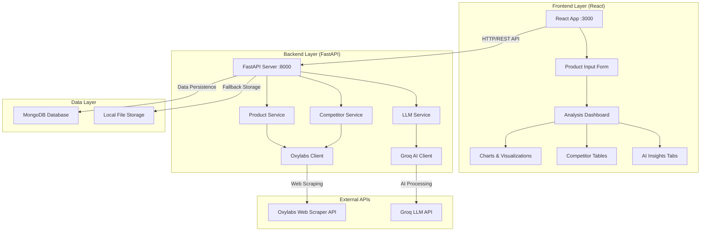
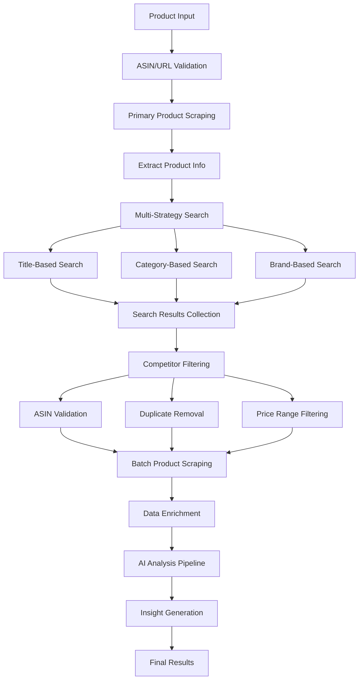
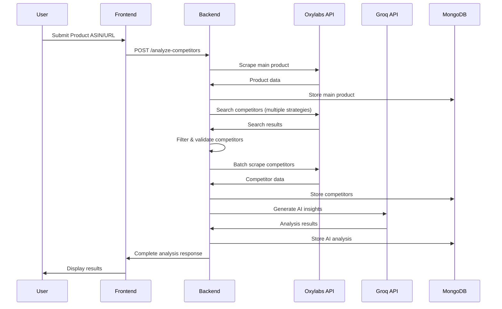

# Amazon Competitor Analysis Platform 🚀

A comprehensive web application for analyzing Amazon product competitors using AI-powered insights. Built with FastAPI backend and React frontend, leveraging Groq's Llama models for intelligent competitor analysis.

   

## 🏗️ System Architecture & Competitor Discovery

### High-Level Architecture


### 🎯 Competitor Discovery Algorithm

Our platform uses a sophisticated multi-step process to identify and analyze competitors:



#### 🔍 **Step 1: Primary Product Analysis**
```python
# Extract comprehensive product data
main_product = oxylabs_client.scrape_product_details(
    asin=main_asin,
    geo_location="10001",  # US ZIP
    domain="com"
)
```

#### 🔍 **Step 2: Multi-Strategy Competitor Discovery**

1. **Title-Based Search**: Search using cleaned product title
2. **Category-Based Search**: Find products in same category
3. **Brand Competition**: Identify competing brands
4. **Price Range Filtering**: Products in similar price segments

```python
# Title-based competitor search
search_results = oxylabs_client.search_products(
    query=cleaned_title,
    domain="com",
    sort_by="relevance",
    category=product_category
)
```

#### 🔍 **Step 3: Intelligent Filtering & Validation**

- **ASIN Validation**: Ensures valid Amazon product IDs
- **Duplicate Removal**: Prevents same product multiple entries
- **Price Range Filtering**: 0.5x to 3x of main product price
- **Category Relevance**: Ensures competitive relevance

#### 🔍 **Step 4: Batch Data Enrichment**

```python
# Parallel competitor scraping with rate limiting
competitor_data = oxylabs_client.scrape_multiple_products(
    asins=competitor_asins,
    domain="com",
    delay=0.5  # Rate limiting
)
```

### 🗄️ Database Schema & Data Flow

#### MongoDB Collections Structure

```javascript
// Products Collection
{
  "_id": ObjectId,
  "asin": "B08Y72CH1F",
  "title": "Wireless Earbuds Pro",
  "brand": "TechBrand",
  "price": 99.99,
  "currency": "USD",
  "rating": 4.5,
  "review_count": 15420,
  "categories": ["Electronics", "Headphones"],
  "specifications": {...},
  "features": [...],
  "images": [...],
  "amazon_domain": "com",
  "geo_location": "10001",
  "scraped_at": ISODate(),
  "last_updated": ISODate()
}

// Competitor Analysis Collection
{
  "_id": ObjectId,
  "main_product_asin": "B08Y72CH1F",
  "competitors": [
    {
      "asin": "B087TXHLVQ",
      "title": "Competitor Earbuds",
      "competitive_score": 8.5,
      "price_difference": -15.99,
      "rating_difference": -0.2,
      "feature_similarity": 0.75
    }
  ],
  "analysis_metadata": {
    "search_strategies": ["title", "category", "brand"],
    "total_found": 47,
    "filtered_count": 15,
    "analysis_date": ISODate()
  }
}

// AI Analysis Results Collection
{
  "_id": ObjectId,
  "main_product_asin": "B08Y72CH1F",
  "analysis_type": "comprehensive",
  "insights": {
    "market_position": {...},
    "pricing_strategy": {...},
    "feature_comparison": {...},
    "competitive_advantages": [...]
  },
  "groq_metadata": {
    "model_used": "llama-3.3-70b-versatile",
    "tokens_used": 2450,
    "processing_time": 3.2
  }
}
```

#### Data Flow Pipeline



### 🧠 AI Analysis Engine

#### Groq LLM Integration
```python
# AI Analysis Pipeline
analysis_prompt = f"""
Analyze this product against its competitors:

Main Product: {main_product}
Competitors: {competitors_data}

Provide insights on:
1. Market positioning
2. Pricing strategy  
3. Feature differentiation
4. Competitive advantages
5. Market opportunities
"""

insights = groq_client.chat.completions.create(
    model="llama-3.3-70b-versatile",
    messages=[{"role": "user", "content": analysis_prompt}],
    temperature=0.3
)
```

#### Analysis Categories Generated:
1. **Market Position Analysis**: Competitive standing assessment
2. **Pricing Strategy**: Pricing competitiveness and positioning
3. **Feature Comparison**: Feature-by-feature competitive analysis
4. **Quality Assessment**: Rating and review analysis
5. **Brand Strength**: Brand perception and market presence
6. **Value Proposition**: Cost-to-benefit analysis
7. **Market Opportunities**: Gaps and improvement suggestions
8. **Competitive Threats**: Risk assessment from competitors
9. **Differentiation Strategy**: Unique selling propositions
10. **Customer Sentiment**: Review sentiment analysis
11. **Performance Metrics**: Quantitative competitive scoring
12. **Market Trends**: Industry trend identification
13. **Recommendation Engine**: Strategic recommendations
14. **Risk Analysis**: Market and competitive risks
15. **Growth Potential**: Market expansion opportunities

### 🔧 Technical Implementation Details

#### Rate Limiting & Optimization
- **Oxylabs Rate Limiting**: 0.5-second delays between requests
- **Batch Processing**: Parallel competitor scraping (max 10 concurrent)
- **Caching Strategy**: MongoDB-based result caching (24-hour TTL)
- **Error Handling**: Graceful fallbacks for API failures

#### Performance Optimizations
- **Async Processing**: Non-blocking I/O operations
- **Connection Pooling**: Reused HTTP connections
- **Data Compression**: Compressed API responses
- **Smart Caching**: Intelligent cache invalidation

#### Scalability Features
- **Horizontal Scaling**: Stateless API design
- **Database Sharding**: MongoDB sharding support
- **Load Balancing**: Multiple server instance support
- **Queue Management**: Background job processing

## ✨ Features

### 🔍 **Product Analysis**
- **Amazon Product Scraping**: Extract detailed product information by ASIN, URL, or product name
- **Multi-Domain Support**: Works with Amazon.com, Amazon.in, Amazon.co.uk, etc.
- **Geo-Location Targeting**: ZIP code-based price and availability analysis

### 🏆 **Competitor Discovery**
- **Multi-Strategy Search**: Title-based, category-based, and sorting-based competitor discovery
- **Advanced Filtering**: Intelligent competitor validation and deduplication
- **Comprehensive Data**: Price, ratings, reviews, features, and specifications

### 🤖 **AI-Powered Insights**
- **Groq LLM Integration**: Powered by Llama 3.3 70B model for intelligent analysis
- **15+ Analysis Categories**: Market positioning, pricing strategy, feature comparison, etc.
- **Interactive Visualizations**: Charts, radar plots, and comparison tables
- **Fallback Analysis**: Ensures meaningful insights even with API limitations

### 📊 **Rich Visualizations**
- **Price Comparison Charts**: Interactive line and bar charts
- **Market Position Radar**: Multi-dimensional competitive analysis
- **Score Cards**: Quick performance metrics overview
- **Detailed Tables**: Comprehensive competitor breakdowns

## 🚀 Quick Setup & Run

### Prerequisites
- **UV Package Manager** (recommended Python package manager)
- **Node.js 16+**
- **Git**

### 1. Clone Repository
```bash
git clone https://github.com/KumarViswanath/amazon-competitor-analysis.git
cd amazon-webscrap
```

### 2. Setup Environment Variables
Create a `.env` file in the project root:

```env
# Oxylabs API Credentials (Required for scraping)
OXYLABS_USERNAME=your_oxylabs_username
OXYLABS_PASSWORD=your_oxylabs_password

# Groq AI API Key (Required for AI analysis)
GROQ_API_KEY=your_groq_api_key_here

# MongoDB Configuration (Optional - uses local file storage if not provided)
MONGODB_URI=mongodb://localhost:27017/amazonanalysis
MONGODB_DATABASE=amazonanalysis

# Server Configuration (Optional)
HOST=0.0.0.0
PORT=8000
```

### 3. One-Command Setup & Run
```bash
# Setup and run both backend and frontend
make run
```

Or step by step:

```bash
# Install all dependencies
make setup

# Run both servers
make run
```

### 4. Manual Setup (Alternative)

#### Backend Setup
```bash
# Install dependencies with UV
uv sync

# Run backend server
make backend
```

#### Frontend Setup
```bash
# Install dependencies (from project root)
make setup

# Start development server
make frontend
```

### 5. Access Application
- **Frontend**: http://localhost:3000
- **Backend API**: http://localhost:8000
- **API Documentation**: http://localhost:8000/docs

## 🔧 Environment Variables Guide

### Required Variables

#### Oxylabs Web Scraper API
```env
OXYLABS_USERNAME=your_username
OXYLABS_PASSWORD=your_password
```
- **Purpose**: Amazon product and competitor data scraping
- **Get API Keys**: [Oxylabs Website](https://oxylabs.io/)
- **Free Trial**: Available for testing

#### Groq AI API
```env
GROQ_API_KEY=gsk_your_api_key_here
```
- **Purpose**: AI-powered competitor analysis using Llama models
- **Get API Key**: [Groq Console](https://console.groq.com/)
- **Free Tier**: Available with rate limits

### Optional Variables

#### Database Configuration
```env
MONGODB_URI=mongodb://localhost:27017/amazonanalysis
MONGODB_DATABASE=amazonanalysis
```
- **Default**: Uses local file storage if not provided
- **MongoDB**: For production deployments with persistence

#### Server Settings
```env
HOST=0.0.0.0
PORT=8000
DEBUG=true
```

## 📁 Project Structure

```
amazon-webscrap/
├── 📄 README.md                    # This file
├── 📄 main.py                      # FastAPI application entry point
├── 📄 app.py                       # Main FastAPI app configuration
├── 📄 pyproject.toml               # Python dependencies
├── 📄 .env                         # Environment variables
├── 📄 .gitignore                   # Git ignore rules
├── 📂 src/                         # Backend source code
│   ├── 📄 models.py                # Pydantic data models
│   ├── 📄 product_service.py       # Product scraping logic
│   ├── 📄 competitor_service.py    # Competitor discovery
│   ├── 📄 llm_service.py           # AI analysis service
│   ├── 📄 oxylabs_service.py       # Oxylabs API client
│   └── 📄 db.py                    # Database operations
├── 📂 frontend/                    # React frontend
│   ├── 📄 package.json             # Node.js dependencies
│   ├── 📂 src/
│   │   ├── 📄 App.js               # Main React component
│   │   ├── 📄 components/          # React components
│   │   └── 📄 styles/              # CSS styles
│   └── 📂 public/                  # Static assets
└── 📂 tests/                       # Test files
```

## 🔄 API Workflow

### 1. Product Scraping
```http
POST /api/products/scrape
Content-Type: application/json

{
  "identifier": "B08N5WRWNW",
  "identifier_type": "asin",
  "zip_code": "10001",
  "domain": "com"
}
```

### 2. Competitor Analysis
```http
POST /api/competitors/analyze
Content-Type: application/json

{
  "asin": "B08N5WRWNW",
  "search_pages": 3,
  "max_competitors": 20
}
```

### 3. AI Analysis
```http
POST /api/llm/analyze
Content-Type: application/json

{
  "main_asin": "B08N5WRWNW",
  "analysis_focus": ["pricing", "features", "positioning"]
}
```

## 🎯 Competitor Discovery Logic

The platform uses a **multi-strategy approach** for comprehensive competitor identification:

### Strategy 1: Title-Based Search
- Cleans product title (removes brand names, common words)
- Searches Amazon using cleaned product name
- Captures direct product alternatives

### Strategy 2: Category-Based Search  
- Uses product's category hierarchy
- Searches within specific categories
- Finds products in same market segment

### Strategy 3: Sorting-Based Search
- Multiple sorting methods: price low-to-high, high-to-low, customer reviews
- Captures competitors across different price ranges
- Identifies quality and budget alternatives

### Filtering & Validation
- ASIN format validation (`^[A-Z0-9]{10}$`)
- Duplicate removal across strategies
- Main product exclusion
- Configurable result limits

## 🤖 AI Analysis Engine

### Groq LLM Integration
- **Model**: Llama 3.3 70B Versatile
- **Temperature**: 0.3 (balanced creativity/accuracy)
- **Max Tokens**: 2000 per analysis
- **Timeout**: 2 minutes with fallback

### Analysis Categories (15+)
1. **Market Positioning** - Competitive landscape analysis
2. **Pricing Strategy** - Price comparison and recommendations
3. **Feature Analysis** - Product feature breakdowns
4. **Brand Strength** - Brand perception and market presence  
5. **Customer Satisfaction** - Review and rating analysis
6. **Market Trends** - Industry trend identification
7. **Competitive Threats** - Risk assessment
8. **Action Plans** - Strategic recommendations
9. **Overall Insights** - Comprehensive summaries
10. **Category Breakdown** - Segment-specific analysis
11. **Review Analysis** - Customer feedback insights
12. **Seasonal Trends** - Time-based patterns
13. **Quality Assessment** - Product quality evaluation
14. **Value Proposition** - Unique selling points
15. **Growth Opportunities** - Market expansion potential

### Fallback System
- Comprehensive pre-generated insights for all categories
- Ensures meaningful analysis even with API failures
- Intelligent content adaptation based on available data

## 🛠️ Development

### Available Commands
```bash
make setup    # Install all dependencies
make run      # Run both backend and frontend
make backend  # Run only backend server  
make frontend # Run only frontend server
make dev      # Development mode (same as run)
make clean    # Clean build files
make help     # Show available commands
```

### Backend Development
```bash
# Install development dependencies
uv sync --dev

# Run tests
uv run pytest tests/

# Code formatting
uv run black src/
uv run isort src/

# Type checking
uv run mypy src/
```

### Frontend Development
```bash
cd frontend

# Install dependencies
npm install

# Start development server with hot reload
npm start

# Build for production
npm run build

# Run tests
npm test
```

### Docker Deployment (Optional)
```bash
# Build and run with Docker Compose
docker-compose up --build

# Run in background
docker-compose up -d
```

## 🔍 Troubleshooting

### Common Issues

#### 1. Oxylabs API Errors
```
Error: Failed to scrape data: 401 Unauthorized
```
**Solution**: Verify `OXYLABS_USERNAME` and `OXYLABS_PASSWORD` in `.env`

#### 2. Groq API Rate Limits
```
Error: Rate limit exceeded
```
**Solution**: Check Groq API usage limits or upgrade plan

#### 3. Frontend Connection Issues
```
Error: Network Error - Cannot connect to backend
```
**Solution**: Ensure backend is running on port 8000

#### 4. Missing Dependencies
```
Command 'uv' not found
```
**Solution**: Install UV package manager
```bash
curl -LsSf https://astral.sh/uv/install.sh | sh
# Or visit: https://docs.astral.sh/uv/getting-started/installation/
```

### Debug Mode
Set `DEBUG=true` in `.env` for detailed logging:
```env
DEBUG=true
LOG_LEVEL=DEBUG
```

## 📊 Performance Metrics

- **Scraping Speed**: ~2-5 seconds per product
- **Competitor Discovery**: ~10-30 seconds (depends on search pages)
- **AI Analysis**: ~15-45 seconds (with Groq API)
- **Concurrent Users**: 10+ (FastAPI async support)
- **Database**: MongoDB for production, file storage for development

## 🤝 Contributing

1. Fork the repository
2. Create feature branch (`git checkout -b feature/amazing-feature`)
3. Commit changes (`git commit -m 'Add amazing feature'`)
4. Push to branch (`git push origin feature/amazing-feature`)
5. Open Pull Request

## 📄 License

This project is licensed under the MIT License - see the [LICENSE](LICENSE) file for details.

## 🙏 Acknowledgments

- **Oxylabs** - Web scraping infrastructure
- **Groq** - AI analysis capabilities  
- **FastAPI** - High-performance web framework
- **React** - Frontend framework
- **Recharts** - Data visualization library

## 📞 Support

For questions or issues:
- Open an [Issue](https://github.com/KumarViswanath/amazon-competitor-analysis/issues)
- Email: rameswaramkumarviswanath@gmail.com
- Documentation: [API Docs](http://localhost:8000/docs)

---

**Made by Kumar Viswanath**
